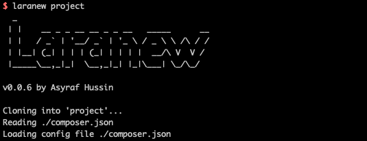

<div align="center">
   
</div>

# laranew

Generate Laravel project based on [Laravel Boilerplate v2](https://github.com/AsyrafHussin/laravel-boilerplate-v2) by Asyraf Hussin

[](https://oclif.io)
[](https://npmjs.org/package/laranew)
[](https://npmjs.org/package/laranew)
[](https://github.com/AsyrafHussin/laranew/blob/master/package.json)

<!-- toc -->

- [laranew](#laranew)
<!-- tocstop -->

## Getting Started

```bash
npm install -g laranew
```

## Usage

```bash
laranew [PROJECT]
```
